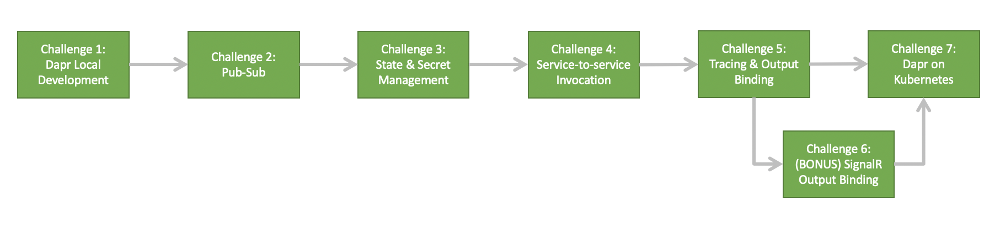

# Building Cloud Native Microservices with Dapr

## Overview & Goals

Microservices can be hard. But, while being exceedingly difficult to architect they have become an increasingly popular architecture pattern. As developers begin to migrate from existing monolithic code bases to a microservices system, they spend much of their time dealing with the inherent challenges presented by distributed applications, such as state management and service invocation 

Enter [Dapr](https://dapr.io/) - A **D**istributed **Ap**plication **R**untime built with developers in mind. Dapr helps out with some of these problems by providing consistent building blocks in the form of http/gRPC APIs that can be called natively or using one of the language SDKs.

Some Dapr lovers have created this workshop with the hopes of illustrating how microservice development can be made easier with Dapr!

\
This workshop **is**:

* An introduction to Dapr and how it enables developers to build resilient, event-driven, stateful and stateless applications

* A series of hands-on challenges that allow participants to implement solutions to the problems commonly faced in microservice development

* A solution that, when completed, provides a set of industry best practices to follow when building distributed systems

\
This workshop is **not**:

* An introduction into microservices or containers

* A Kubernetes workshop 

* An opportunity to learn new programming languages

## Target Audience

This workshop was created for software developers who are looking to gain a deeper understanding of how to build cloud native, distributed applications. Ideally, those looking to participate will have previous hands-on experience with microservice-based applications, however knowledge of the architectural style may also be sufficient.

Experience with the following is required:

* Azure Cloud
* Kubernetes-hosted, containerized applications (any distribution, AKS recommended)
* Software Development with one or more programming languages 

Experience with the following is recommended:

* .Net Core, NodeJS or Golang programming languages 
* Distributed systems

## Learning Objectives

Over the period of approximately two days, participants will use a variety of Dapr components to build out and deploy a complete system of microservices that will replace Cloud Coffee Company's core Ordering Platform. The Dapr learning objectives that will be covered are as follows:

| Objective      | Description                                                                                |
|------------------|-------------------------------------------------------------------------------------------------------------|
| Dapr Local Development | Get Dapr running locally and set-up a local development environment. |
| Pub-sub | Use a Dapr pub-sub component to publish orders to three different subscribers.     |
| State & Secret Management   | Use Dapr State and Secret building block APIs to store and access data. |
| Service-to-service Invocation | Implement service-to-service invocation calls between microservices. |
| Distributed Tracing | Configure and view end-to-end tracing across Dapr components. |
| Output Bindings | Construct storage and SignalR output bindings. |
| Dapr on K8s | Configure and deploy microservices application and all Dapr components onto AKS. |

## Challenge Path

The diagram below is a depiction of the workshop journey and an overview of the Dapr concepts that will be covered along the way. 

**NOTE:** Challenge 6 is optional, as it does not provide an introduction to any new Dapr concepts, but rather improves the UI. Challenge 7 is a multi-part challenge as it deals with the operationalization of Dapr projects as a whole.

\

## Lets Begin!

Once you are ready, please begin by installing the [prerequisites](./prerequisites.md) and reading the [customer story](customer-story.md)...

\
 *Built with love by the Dapr Vigilantes* TM 
