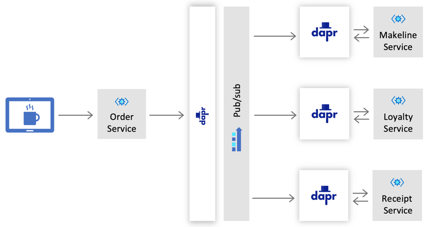

# Challenge 2: Handling Orders

Dapr enables developers to design their application with a [pub/sub pattern](https://docs.microsoft.com/en-us/azure/architecture/patterns/publisher-subscriber) using a message broker of their choice. With this approach, consumers and producers are decoupled from one another, and communicate by sending and receiving messages that are associated with a topic.

As orders are received by the Coffee Company, the services that will handle each order independently include:

| Service     | Description                                                 |
|-------------|-------------------------------------------------------------|
| Makeline    | Responsible for the processing and delivery of each order   |
| Loyalty     | Manages the loyalty program for customers rewards and points|
| Receipts    | Archives orders for auditing and historical purposes        |

## Challenge

Using the publisher-subscriber pattern, Cloud Coffee Company will like to implement a design that is represented in the following diagram:



### Configure a Publish/Subscribe Component

Using any of the [supported message brokers](https://docs.dapr.io/operations/components/setup-pubsub/setup-pubsub-overview/), configure a Dapr pub/sub component for the following services listed in the table below:

| Service     | Topic Name     | Publisher or Subscriber  | App Port  | Dapr HTTP Port | Dapr GRPC Port|
|-------------|----------------|--------------------------|-----------|-----------|------|
| Order       | `orders`       | Publisher                | 5100      | 5180      | 5101     |
| Makeline    | `orders`       | Subscriber               | 5200      | 5280      | 5201     |
| Receipt     | `orders`       | Subscriber               | 5300      | 5380      | 5301     |
| Loyalty     | `orders`       | Subscriber               | 5400      | 5480      | 5401     |

A note about Dapr Components: Consider using the `components` directory that is located at the root to store all your Dapr component files as some of them may be used across multiple services.

### Publish and Subscribe Incoming Orders

- **Publish**
  - Add code to the Order service that will [publish](https://docs.dapr.io/developing-applications/building-blocks/pubsub/howto-publish-subscribe/#step-3-publish-a-topic) a message to the `orders` topic for each incoming request.
  - Incoming request to the order service example:

    ```JSON
    {
        "storeId": "Redmond",
        "customerName": "Chewy",
        "loyaltyId": "1",
        "orderItems": [
            {
                "menuItemId": 1,
                "quantity": 1
            },
            {
                "menuItemId": 2,
                "quantity": 1
            },
            {
                "menuItemId": 3,
                "quantity": 3
            }
        ]
    }  
    ```

  - Published order message example:
  
    ```JSON
    {
      "storeId": "Redmond",
      "orderId": "b85d631a-101e-005a-02f2-cee7aa06f148",
      "orderDate": "2020-02-15T11:53:00.000Z",
      "customerName": "Chewy",
      "loyaltyId": "1",
      "orderTotal": 1.25,
      "orderItems": [{
          "menuItemId": 1,
          "menuItemName": "Latte",
          "quantity": 1
      }]
    }
    ```

- **Subscribe**

  - Create an endpoint on each of the services (Makeline, Loyalty and Receipt) to support a [subscription](https://docs.dapr.io/developing-applications/building-blocks/pubsub/howto-publish-subscribe/#step-2-subscribe-to-topics) to the `orders` topic. The endpoint should have the following route: `/dapr/subscribe`.
  
  - Add the handler and necessary code to each of the subscriber services that will handle incoming messages from the `orders` topic.

- **Secure Application Access**

  - The Cloud Coffee Company wants to make sure that the pub/sub component is only available to certain applications. Dapr allows you to add scopes into your components yaml files to limit access for a certain application, or a specific set of applications. Add the necessary [scopes](https://github.com/dapr/docs/tree/master/howto/components-scopes) to the component to ensure that only the following application IDs are able to use it:

    | Application name   | Application ID             |
    |--------------------|----------------------------|
    | Makeline           | make-line-service          |
    | Receipts           | receipt-generation-service |
    | Order              | order-service              |
    | Loyalty            | loyalty-service            |

## Success Criteria

- Post an order to the Order service and confirm that a message is successfully published.
- Confirm that all three subscribing services are receiving a message for incoming orders.
- Demonstrate that access to the pub/sub component is granted to the allowed applications.

## References

- [Dapr building blocks](https://docs.dapr.io/developing-applications/building-blocks/)
- [Dapr concepts - Publish/Subscribe Messaging](https://docs.dapr.io/developing-applications/building-blocks/pubsub/pubsub-overview/)
- [Use Pub/Sub to consume messages from topics](https://docs.dapr.io/developing-applications/building-blocks/pubsub/howto-publish-subscribe/)
- [Publish a message to a given topic](https://docs.dapr.io/developing-applications/building-blocks/pubsub/howto-publish-subscribe/#step-3-publish-a-topic)
- [Dapr Pub-Sub quickstart](https://github.com/dapr/quickstarts/tree/master/pub-sub)
- [Dapr components](https://docs.dapr.io/concepts/components-concept/)
- [Publisher-Subscriber pattern](https://docs.microsoft.com/en-us/azure/architecture/patterns/publisher-subscriber)
- [Create a Service Bus Namespace](https://docs.microsoft.com/en-us/azure/service-bus-messaging/service-bus-create-namespace-portal)
- [Component Scopes on Dapr](https://docs.dapr.io/operations/components/component-scopes/)

## Next Challenge

Once you have you pub/sub working, proceed to the next challenge and work with the [Loyalty](challenge-3.md) service.
