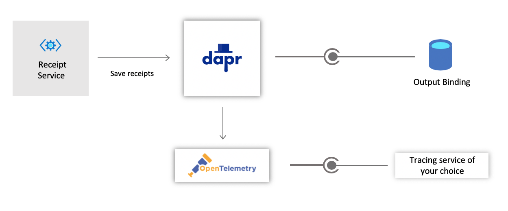

# Challenge 5: Receipts

Thanks to all of your hard work, the Cloud Coffee Company (CCC) is thriving with their online business. They now have a flourishing loyalty program and a streamlined process for handling drink orders, all running with the help of [Dapr](https://github.com/dapr)!

The last component that needs to be integrated into the solution will be the **Receipt Generation** service. As customer orders are received, CCC will need to save the receipt of each order for their auditing and archiving needs.

This challenge will take advantage of the Dapr [bindings](https://docs.dapr.io/developing-applications/building-blocks/bindings/) building block API to seamlessly record the receipt for each incoming order. In addition, the Cloud Coffee Company would like for you to institute [tracing](https://docs.dapr.io/operations/monitoring/) across all their services so that they could accurately measure and diagnose any performance and runtime issues.

## Bindings

Bindings provide a consistent way to trigger an application from an external system or service. Additionally, a binding enables an application to invoke an external system and provide it with any relevant data payloads. Bindings are a vital component in an event-driven architecture that promotes on-demand compute and the abstraction of any SDKs or boilerplate code needed to integrate with those systems.

## Distributed Tracing

Distributed tracing is a method used to profile and observe applications. Having the ability to trace requests across systems and services is an essential requirement for monitoring microservices and any distributed architecture solution. Dapr uses OpenTelemetry (previously known as OpenCensus) for distributed traces and metrics collection. Tracing can be configured to work with many popular tracing backends, including custom solutions.

## Challenge

Cloud Coffee Company envisions an architecture that resembles the following diagram:



In this design, CCC would like to leverage an output binding that will ultimately save their receipts into a data store repository. They would also like to configure distributed tracing to observe, troubleshoot and profile all their services.

**Note:** There a many options for output bindings in Dapr. It's important to select a binding that will serve as a reliable repository for the receipts.

### Save Receipts Using an Output Binding

In an [earlier challenge](challenge-2.md), a pub/sub component was configured to help services respond to new orders. The **Receipt Generation** service, along with the **Makeline** and **Loyalty** services, subscribe to the `orders` topic so that they could handle each order. Using the existing subscription, you will need to update the Receipt service with the following functionality:

- Select and configure a [supported output binding](https://docs.dapr.io/operations/components/setup-bindings/supported-bindings/) that will provide storage for customer receipts.
  - A sample request to the binding endpoint, might resemble:

    ```JSON
    {
        "data": {
            "storeId": "Redmond",
            "orderId": "269e75ea-3b70-46ef-87d8-c284fe8b3be7",
            "orderDate": "2020-01-13T11:53:00.000Z",
            "customerName": "Bruce Wayne",
            "loyaltyId": "42",
            "orderTotal": 7.60,
            "orderItems": [
                {
                    "menuItemId": 1,
                    "menuItemName": "Latte",
                    "quantity": 1
                }
            ]
        },
        "metadata": {
            "blobName": "{unique-file-name}.json"
        }
    }
    ```

- Add code in the **Receipt Generation** service when a new order is received, to call the output binding and save the customer order details as the receipt.
- Add the necessary [scopes](https://docs.dapr.io/operations/components/component-scopes/) to the output binding component to ensure that **only** the Receipt service has access.

### Configure Distributed Tracing

As you can imagine, distributed tracing can be a difficult challenge when working with microservices and a distributed systems architecture. Dapr simplifies this by leverage it's tracing middleware component to work with a wide selection of services. CCC would like for you enable tracing across all their services. To meet their requirements, you will need to:

- Select and configure a tracing service and apply it to all the Dapr-enabled services in the solution.
- Generate orders to create the tracing logs. The code repository includes two optional projects that you can use to submit orders:
  - **Virtual Customers**: A console application that will generate a collection of random orders each time it is run.
  - **Web Site**: A website that provides an interactive user interface for selecting and ordering drinks.

Note, you can also submit orders manually by posting the relevant data payloads to the related services.

### A Note about Tracing with VS Code and the Launch Tasks

If you are using VS Code and have decided to leverage the launch tasks, you will need to name your tracing configuration file `dapr-workshop.tracing.yaml`.

## Success Criteria

- Submit several orders and demonstrate that receipts are saved with the configured output binding.
- Provide evidence through a dashboard or logs that tracing is working across all the services in the solution.

## References

- [Dapr building blocks](https://docs.dapr.io/concepts/building-blocks-concept/)
- [Bindings concept](https://docs.dapr.io/developing-applications/building-blocks/bindings/bindings-overview/)
- [Bindings specifications](https://docs.dapr.io/developing-applications/building-blocks/bindings/howto-triggers/#1-create-a-binding)
- [Dapr Bindings sample](https://docs.dapr.io/developing-applications/building-blocks/bindings/howto-triggers/#1-create-a-binding)
- [Send events to output bindings](https://docs.dapr.io/developing-applications/building-blocks/bindings/howto-bindings/)
- [Distributed tracing](https://docs.dapr.io/operations/monitoring/)
- [Set up distributed tracing with Application insights](https://docs.dapr.io/operations/monitoring/azure-monitor/)
- [Set up distributed tracing with Zipkin](https://docs.dapr.io/operations/monitoring/zipkin/)

## Next Challenge

You've reached a major milestone in the workshop and have a few options moving forward:

- Add near-real time updates to the Website project using Azure SignalR: [Live updates](challenge-6.md)
- Deploy and run the solution on Kubernetes: [Run in Azure Kubernetes Service](challenge-7.md)
