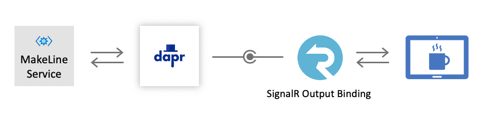

# Challenge 6: Order Updates with Azure SignalR

**Disclaimer**: This is an optional challenge that leverages the SignalR binding component.

------------

The Cloud Coffee Company (CCC) is extremely pleased with all the progress that has been made. They have in place an order management system, a loyalty program and an archive system for their customer's receipts - all thanks to you and [Dapr](https://github.com/dapr)!

CCC is now asking for enhancements to their website that will allow them to view the orders that are being processed in real time. In order to accomplish this, they would like to use [Azure SignalR](https://azure.microsoft.com/en-us/services/signalr-service/) to notify the website when orders are being created and processed.

## Azure SignalR and Output Bindings

The [Azure SignalR](https://azure.microsoft.com/en-us/services/signalr-service/) service provides functionality for pushing content over HTTP to connected clients, such as a web page or mobile application. This approach allows clients to respond to updates without the need for polling the server or submitting requests for new content.

Dapr provides support through the bindings building block to push messages to Azure SignalR without requiring a SDK or additional libraries to communicate with the service. Using the same, consistent API for all output bindings, sending a message from Dapr to the Azure SignalR service is very straightforward and familiar.

## Challenge

In the [previous challenge](challenge-5.md), the Dapr [bindings](https://docs.dapr.io/developing-applications/building-blocks/bindings/bindings-overview/) component was leveraged to save receipts to a data repository. This time, another building block will be used to publish order details to SignalR. This challenge will update the **MakeLine** service with the Azure SignalR output binding component. The outcome is depicted in the following diagram:



Each time the MakeLine service receives or completes an order, it will publish an event to SignalR through the Dapr [output binding API](https://docs.dapr.io/developing-applications/building-blocks/bindings/howto-bindings/). The website, in this scenario, is just another connected client that will receive those pushed updates and render the information on a web page accordingly.

### Azure SignalR service

Provision a new instance of the Azure SignalR Service:

- Select the **Serverless** option for the service mode

- Make a copy of one of the available connection strings for future use

### SignalR connection string

We are going to continue with following some good practices and store the Azure SignalR connection string in a secret store. After the SignalR service is provisioned:

- Retrieve the connection string and add it to the same secret store that was configured in an [earlier challenge](challenge-3.md).

- Name the secret `signalr-connectionstring`.

### Output binding component for SignalR

Add a new Dapr output binding component for SignalR.

- Create a component based off of the [SignalR Binding spec](https://docs.dapr.io/operations/components/setup-bindings/supported-bindings/signalr/)

- Instead of placing the connection string inside of the component, reference the value from the secret store

- Events should be published to a hub called `orders`. You can set the optional value in the component or include in the metadata later when sending the event to SignalR.

- Add the necessary [scopes](https://docs.dapr.io/operations/components/component-scopes/) to the SignalR output binding component to ensure that **only** the Makeline service has access.

### Retrieve the connection string

In the **MakeLine** project, the `MakelineController` class has a method called `GetSignalrConnectionString`. Update the method to do the following:

- Use the [Secrets API](https://docs.dapr.io/developing-applications/building-blocks/secrets/howto-secrets/#calling-the-secrets-api) to retrieve the SignalR connection string from the secret store

- Using [scopes](https://docs.dapr.io/operations/components/component-scopes/), add the Makeline service to the list of applications that have access to the secret store component.

- Return the connection string

### Send updates

With the output binding component configured and the connection string secured, its time to add support for calling the SignalR service.

- Find another method in the `MakelineController` class called `SendOrderUpdate`

- Using the specification for the [SignalR binding](https://docs.dapr.io/operations/components/setup-bindings/supported-bindings/signalr/), add the necessary code to [send an event to the output binding](https://docs.dapr.io/developing-applications/building-blocks/bindings/howto-bindings/)

- For convenience, you may use or reference the `OrderSummaryUpdateData` object for the `data` portion of the request.

- Sample output binding request:

 ```JSON
{
    "data": {
        "Target": "newOrder",
        "Arguments": [
        {
          "storeId": "Redmond",
          "orderId": "478a9801-c54e-4c0f-811b-0a755ccffa06",
          "orderDate": "2020-02-15T11:53:00.000Z",
          "customerName": "Michael Knight",
          "loyaltyId": "100",
          "orderTotal": 4.50,
          "orderItems": [{
             "menuItemId": 1,
             "menuItemName": "menu item name",
             "quantity": 1
          }]
        }
      ]
    },
    "metadata": {
        "hub": "orders"
    }
}
```

### Incoming orders

As orders are coming in, send an update to SignalR to notify clients that they have been received:

- Find the `MakeOrder` method in the `MakelineController` class
- At then end of the function, after an incoming order is successfully saved, add code to call the `SendOrderUpdate` function. The event name should be `newOrder` and the code should look similar to:

  ```csharp
  await SendOrderUpdate("newOrder", orderSummary);
  ```

### Completed orders

In the previous challenge, you added a function that was invoked by the **Virtual Barista** service to complete orders. Add code to the end of this function that will:

- Call the `SendOrderUpdate` function with the event name `completedOrder`. The code should look just like:

  ```csharp
  await SendOrderUpdate("completedOrder", orderSummary);
  ```

### Enable CORS for retrieving orders

The last piece is to ensure that the website can call the Makeline service method that returns a list of orders waiting to be completed. This will require the method to be decorated with a CORS policy, like this:

```csharp
[EnableCors("CorsPolicy")]
[HttpGet("/orders/{storeId}")]
public async Task<IActionResult> GetOrders(string storeId)
{
    ...
}
```

- Find the method that was added to retrieve all orders

- Enable CORS by adding the `CorsPolicy` property to the method

## Success Criteria

To complete this challenge, demonstrate that you can:

1. Launch the website and make sure it is running under port `8080`. This can be achieved by running `npm install` and `npm run serve` with the default settings.

2. Place several orders, either from the site or by running the **Virtual Customers** project.

3. Navigate to the **Orders** page on the website and observe how orders are added and removed from the list as they are processed in real time.

## References

- [Bindings concept](https://docs.dapr.io/developing-applications/building-blocks/bindings/bindings-overview/)
- [Dapr bindings sample](https://docs.dapr.io/developing-applications/building-blocks/bindings/)
- [Send events to output bindings](https://docs.dapr.io/developing-applications/building-blocks/bindings/howto-bindings/)
- [SignalR binding specification](https://docs.dapr.io/operations/components/setup-bindings/supported-bindings/signalr/)
- [How to set up a secret store](https://docs.dapr.io/developing-applications/building-blocks/secrets/secrets-overview/)

## Next Challenge

Deploy and run the solution on Kubernetes: [Run in Azure Kubernetes Service](challenge-7.md)
