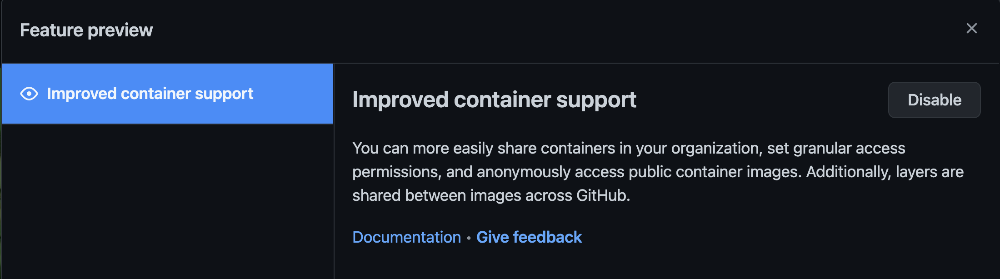
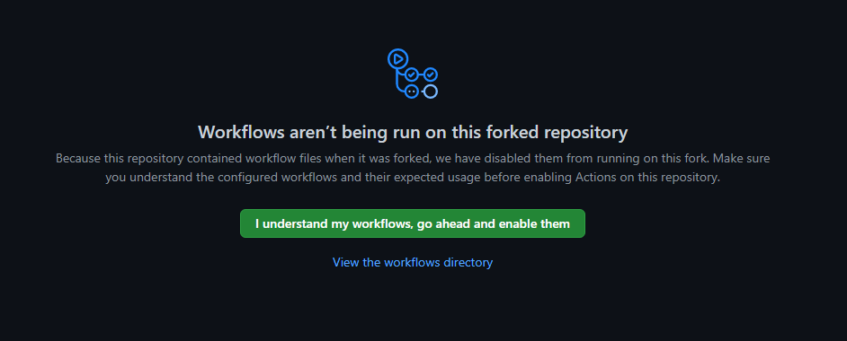
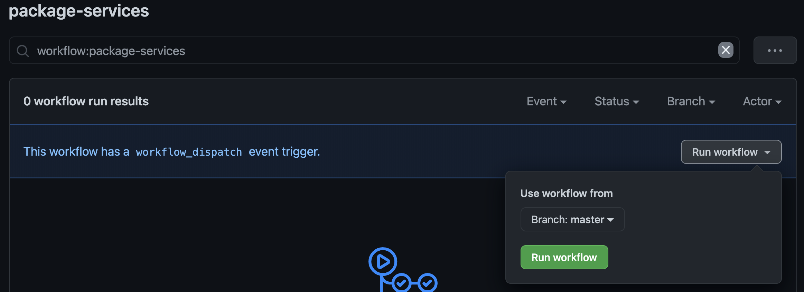
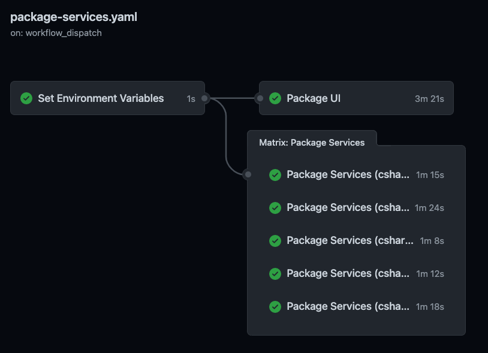
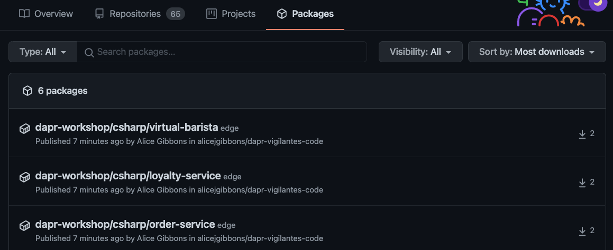
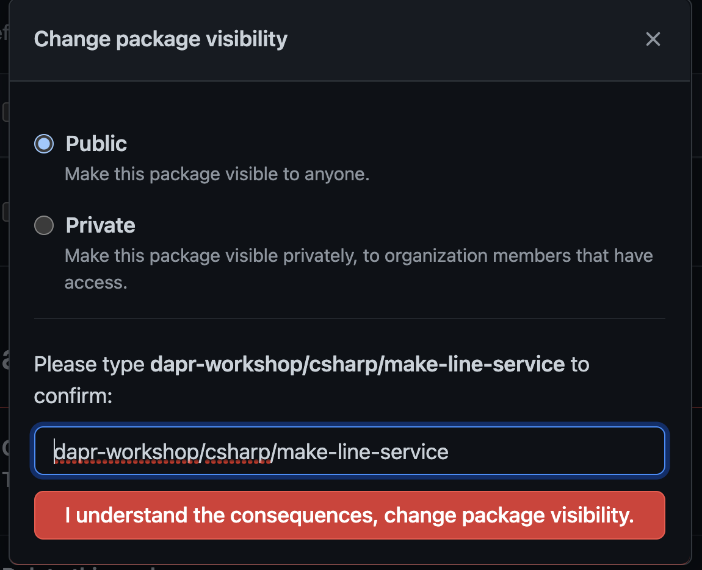

# Challenge 7: Deploy Core System to Kubernetes

Congratulations! You've completed the implementation of all the Core Services for Cloud Coffee Co! They are very impressed with your progress and all that's left to do is to deploy the solution in Azure. The Cloud Architecture team at CCC has chosen to deploy the services on [Azure Kubernetes Service](https://azure.microsoft.com/en-us/services/kubernetes-service/) as it a scalable solution for microservices-based applications and it plays very nicely with Dapr! 

For more information on how Dapr works with Kubernetes, read [this](https://docs.dapr.io/operations/hosting/kubernetes/kubernetes-overview/) doc.


## Part 1: Create AKS Cluster

First we will create a new Azure Kubernetes Services (AKS) cluster to deploy the services.

1. In a new bash shell, login to the Azure CLI.

   ``` bash
   # Follow CLI prompts to authenticate
   az login
   ```

   > Note: You may also use the Azure Cloud Shell where you are automatically logged into your Azure subscription.

2. Ensure you are using the correct Azure subscription you want to deploy the AKS cluster to.

   ``` bash
   # View all subscriptions
   az account list -o table

   # Verify selected subscription
   az account show -o table
   ```

   ``` bash
   # Set correct subscription (if needed)
   export SUBSCRIPTION_ID="<YourSubscriptionID>"
   az account set --subscription $SUBSCRIPTION_ID

   # Verify correct subscription is now set
   az account show -o table
   ```

3. Create a unique identifier suffix to name the Azure resources to be created in this challenge. This value will be used in the next few steps.

   ```bash
   UNIQUE_SUFFIX=dapr$USER
   # Remove underscores (Not allowed in AKS and ACR Names)
   UNIQUE_SUFFIX="${UNIQUE_SUFFIX//_}"
   # Check unique suffix value (Should have no underscores)
   echo $UNIQUE_SUFFIX
   ```
   

4. If you don't already have an Azure Resource Group from the previous challenges, create a Resource Group in the location of your choice.

   ```bash
   # Set Resource Group Name using the unique suffix
   RGNAME=rg-$UNIQUE_SUFFIX
   # Choose a default location for your Azure resources, for instance westus
   LOCATION=westus
   # Create Resource Group
   az group create -n $RGNAME -l $LOCATION
   ```


5. Create your AKS cluster in the resource group created above with 3 nodes. We will check for a recent version of kubernetes before proceeding. You will use the Service Principal created in the previous steps to deploy the cluster.

   ```bash
   # Set AKS Cluster Name
   CLUSTERNAME=aks-${UNIQUE_SUFFIX}
   # View AKS Cluster Name for Future Reference
   echo $CLUSTERNAME
   ```

   Get available kubernetes versions for the region. You will likely see more recent versions in your lab.

   ```bash
   az aks get-versions -l $LOCATION -o table

   KubernetesVersion    Upgrades
   -------------------  -------------------------
   1.19.6               None available
   1.19.3               1.19.6
   1.18.14              1.19.3, 1.19.6
   1.18.10              1.18.14, 1.19.3, 1.19.6
   1.17.16              1.18.10, 1.18.14
   1.17.13              1.17.16, 1.18.10, 1.18.14
   1.16.15              1.17.13, 1.17.16
   1.16.13              1.16.15, 1.17.13, 1.17.16
   ```

   Set the Kubernetes version to the newest one with available upgrades (in this case 1.19.6)

   ```bash
   K8SVERSION=1.19.6
   ```

   Create your AKS cluster using the following command. 

   ```bash
   # Create AKS Cluster
   az aks create -n $CLUSTERNAME -g $RGNAME \
   --kubernetes-version $K8SVERSION \
   --enable-managed-identity \
   --network-plugin azure \
   --generate-ssh-keys \
   --location $LOCATION \
   --node-count 3 \
   --no-wait
   ```
   This command can take anywhere from 5-10 minutes to run so please be patient and grab a coffee...

>Note: If you don't have permission to create a managed identity in your subscription, you may have your Azure Administrator create it beforehand. In this case add the `--assign-identity <identity-id>` argument to your cluster creation command. For more detailed instructions, read [this doc](https://docs.microsoft.com/en-us/azure/aks/use-managed-identity#bring-your-own-control-plane-mi).

6. After a few minutes, verify your cluster status. The `ProvisioningState` should be `Succeeded`.

    ```bash
    az aks list -o table
    ```

    ```bash
   Name              Location    ResourceGroup    KubernetesVersion    ProvisioningState    Fqdn
   ----------------  ----------  ---------------  -------------------  -------------------  ---------------------------------------------------------------
   aks-dapralgibbon  westus      rg-dapralgibbon  1.19.6               Succeeded            aks-dapral-rg-dapralgibbon-730aaa-207c2eb6.hcp.westus.azmk8s.io

    ```

8. Get the Kubernetes config file for your new AKS cluster so you can run `kubectl` commands.

    ```bash
    az aks get-credentials -n $CLUSTERNAME -g $RGNAME
    ```

9. Verify you have API access to your new AKS cluster

    ```bash
    kubectl get nodes

   NAME                                STATUS   ROLES   AGE     VERSION
   aks-nodepool1-21298120-vmss000000   Ready    agent   2m6s    v1.19.6
   aks-nodepool1-21298120-vmss000001   Ready    agent   2m11s   v1.19.6
   aks-nodepool1-21298120-vmss000002   Ready    agent   2m12s   v1.19.6
    ```
     > Note: It can take a few minutes for your nodes to appear and be in the `Ready` state. You can run `kubectl get nodes --watch` to monitor status.

    To see more details about your cluster, run the following.

    ```bash
    kubectl cluster-info

   Kubernetes master is running at https://aks-dapral-rg-dapralgibbon-730aaa-207c2eb6.hcp.westus.azmk8s.io:443
   CoreDNS is running at https://aks-dapral-rg-dapralgibbon-730aaa-207c2eb6.hcp.westus.azmk8s.io:443/api/v1/namespaces/kube-system/services/kube-dns:dns/proxy
   Metrics-server is running at https://aks-dapral-rg-dapralgibbon-730aaa-207c2eb6.hcp.westus.azmk8s.io:443/api/v1/namespaces/kube-system/services/https:metrics-server:/proxy
    ```
    
    You should now have a Kubernetes cluster running with 3 nodes. You will not see the master servers for the cluster because these are managed by Microsoft. The Control Plane services which manage the Kubernetes cluster including the scheduling, API access, configuration data store and object controllers are all being provided as services to these nodes.

<br/>

---

<br/>

## Part 2: Setup GitHub Container Registry and Create Docker containers

1. Navigate to your personal profile in GitHub and click on the dropdown arrow next to your avatar. 

   Open the Feature Preview option and enable "Improved Container Support". This will allow you to push container images to your personal GitHub account and access them publicly over the internet.

   

   To enable this for a GitHub organization read [this](https://docs.github.com/en/packages/guides/enabling-improved-container-support#enabling-github-container-registry-for-your-organization-account).

2. Create a Personal Access Token in your own GitHub account. Click on your personal avatar -> Settings -> Developer Settings. In the Personal Access Tokens section choose 'Generate new token'.

   Name it something you will remember to delete later and give it the following permissions:
   - Select the `read:packages` scope to download container images and read their metadata.
   - Select the `write:packages` scope to download and upload container images and read and write their metadata.
   - Select the `delete:packages` scope to delete container images.

   >Note: Copy this token down before leaving the page!

3. Create a GitHub Secret in the forked copy of the repository. Navigate to the repo -> Settings, and on the left-hand menu under Secrets choose 'New repository secret'. 

   Name your secret `CR_PAT` and give it the value of your Personal Access Token.

4. Navigate to the .github/workflows folder in your copy of the repo. Open the `package-services.yaml` file and edit the "Set Environment Variables" job as follows:
   - Remove the languages that you are not using from the `languages` array.
   - Update the `repositories` array with your GitHub Container Registry URL. This will be in the format shown below using your personal Github username.

   When completed the 'main' step in the 'set-env' job will look something like this (for csharp services):

   ```yaml
   ...
   echo ::set-output name=languages::[\"csharp\"]
   echo ::set-output name=services::[\"LoyaltyService loyalty-service\", \"MakeLineService make-line-service\", \"OrderService order-service\", \"ReceiptGenerationService receipt-generation-service\", \"VirtualBarista virtual-barista\"]
   echo ::set-output name=repositories::[\"ghcr.io/<Your-GitHub-Name>/dapr-workshop\"]
   ...
   ```

   Similarly, edit the 'Package UI' job so that the 'Build and push' step tags your containers with your GitHub Container Registry. When completed the 'tags' block will look something like this:

   ```yaml
   ...
   tags: |
      ghcr.io/<Your-GitHub-Name>/dapr-workshop/node/ui:latest
      ghcr.io/<Your-GitHub-Name>/dapr-workshop/node/ui:${{ needs.set-env.outputs.version }}
   ...
   ```

   Commit and push these changes to the master branch.

5. Navigate to your forked repo under the Actions Tab. You will have to choose "I understand my workflows, go ahead and enable them" in order for the GitHub Actions included in the project to show up in the UI.

   

   Choose the 'package-services' Workflow from the list and run the workflow from the master branch using the workflow_dispatch trigger.

   

6. Click into the running workflow to watch your containers get published to your GitHub Container Registry. At minimum you should have five 'Package Services' Jobs that run in the language of your choice as well as the Package UI Job. Ensure these jobs complete successfully before moving on.

   

   On successful completion of all jobs, navigate to your personal GitHub profile, under the Packages tab. You should see your six container images listed there and be able to click into each one for additional details.

   

   For each of the container images, change the 'Package visibility' to Public. Do this by clicking on each package -> Package Settings -> Change package visibility, and choose the Public option.

   

   Making these packages available publicly will allow your Kubernetes cluster to pull the container images down to the nodes on service deployment. Ensure that you repeat this step for each microservice.


### Additional Docs & References

- [About GitHub Container Registry](https://docs.github.com/en/packages/guides/about-github-container-registry)
- [Pushing and Pulling Docker images in GitHub CR](https://docs.github.com/en/packages/guides/pushing-and-pulling-docker-images)

<br/>

---

<br/>

## Part 3: Setup Cluster for Service Deployments

1. Open the bash terminal used in the previous steps where you were connected to your AKS cluster. Install Dapr on your AKS cluster using **Helm**.

   ```bash
   # Create a namespace to store the Dapr core components
   kubectl create namespace dapr-system

   # Add the dapr Helm charts to your Helm repo and install Dapr into the dapr-system namespace
   helm upgrade --install dapr dapr/dapr --version=1.0.0-rc.3 --namespace dapr-system --wait
   ```

   Once the chart installation is complete, verify the dapr-dashboard, dapr-operator, dapr-placement-server, dapr-sentry and dapr-sidecar-injector pods have a status of `Running` in the dapr-system namespace.

   ```bash
   kubectl get pods -n dapr-system

   NAME                                     READY   STATUS    RESTARTS   AGE
   dapr-dashboard-6c4b54cc55-7bxdb          1/1     Running   0          60s
   dapr-operator-79df664bd-7rdf6            1/1     Running   0          60s
   dapr-placement-server-0                  1/1     Running   0          60s
   dapr-sentry-56df54f4d9-5dlbb             1/1     Running   0          60s
   dapr-sidecar-injector-56ddf9d5c4-bdntz   1/1     Running   0          60s

   ```

   > Note: These commands will only work with Helm 3. Check your helm version by running `helm version` and install the updated binaries using the instructions in the [Prerequisites](prerequisites.md) doc.

### Additional Docs & References

- [Troubleshoot Kubernetes Clusters](https://kubernetes.io/docs/tasks/debug-application-cluster/debug-cluster)

- [Kubernetes Namespaces](https://kubernetes.io/docs/concepts/overview/working-with-objects/namespaces/)

- [Install Dapr on Kubernetes](https://docs.dapr.io/getting-started/install-dapr-kubernetes/#install-with-helm-advanced)

<br/>

---

<br/>

## Deploy Microservices

Now that the cluster is setup with Dapr it is time to deploy the microservices! The CCC Ops team has an end-to-end devops process using GitHub Actions along with Helm charts to deploy the microservices.

> Note: It is important that your app code be able to read the dapr HTTP port from an environment variable before deploying it to Kubernetes. In Kubernetes, the dapr sidecar **always** runs on port 3500 for http calls so if your microservices use a hardcoded port in their Dapr URLs from local development then you must update them before deploying. 

1. First we have to deploy a Dapr Configuration setting in order for features like Distributed Tracing to work.

   **Option A) If you're using App Insights for Distributed Tracing, follow below - otherwise skip to Option B.**

   Dapr integrates with the [OpenTelemetry Collector](https://github.com/open-telemetry/opentelemetry-collector) using the Zipkin API. To view this data in Application Insights, Dapr can push trace events through the OpenTelemetry Collector.
   
   First, save your Application Insights Instrumentation Key as an environment variable.

   ```bash
   # Copy value from the Overview blade in the Azure portal
   export APP_INSIGHTS_KEY=<your-app-insight-key>
   ```

   Download the [open-telemetry-collector.yaml](https://docs.dapr.io/docs/open-telemetry-collector/open-telemetry-collector.yaml) file and replace the `<INSTRUMENTATION-KEY>` placeholder with your `APP_INSIGHTS_KEY`. Deploy the OpenTelemetry Collector to the `dapr-workshop` namespace as follows and check that it has been deployed correctly.

   ```bash
   kubectl apply -f open-telemetry-collector.yaml -n dapr-workshop

   kubectl get all -n dapr-workshop -l app=opentelemetry

   NAME                                  READY   STATUS    RESTARTS   AGE
   pod/otel-collector-67f645b9b7-kdv25   1/1     Running   0          27m
   ...
   ```

   Now, use a Dapr configuration file to turn on the distributed tracing capabilities and deploy the tracing exporter component that calls the OpenTelemetry Collector. Download the [collector-config.yaml](https://docs.dapr.io/docs/open-telemetry-collector/collector-config.yaml) file, update the name to be `tracing`, the namespace to be `dapr-workshop` and deploy the component as follows. 

   ```yaml
   apiVersion: dapr.io/v1alpha1
   kind: Configuration
   metadata:
      name: tracing
      namespace: dapr-workshop
   ...
   ```

   ```bash
   kubectl apply -f collector-config.yaml -n dapr-workshop

   # Check that the tracing exporter has been deployed correctly
   kubectl get configuration.dapr.io/tracing -n dapr-workshop

   NAME        AGE
   tracing   8m29s
   ```

   Now, after deploying the microservices in the next step, be sure to check back to App Insights and watch your data flow in!
   
   <br/>

   **Option B) If you are not using App Insights then we will set up Zipkin for the Distributed Tracing Configuration**

   ```bash
   # Deploy a Zipkin Deployment 
   kubectl create deployment zipkin --image openzipkin/zipkin -n dapr-workshop

   # Create a Kubernetes Service for the Zipkin Pod
   kubectl expose deployment zipkin --type ClusterIP --port 9411 -n dapr-workshop
   ```

   Next, run the following command to create and deploy the Dapr Configuration object named `tracing`:

```bash
cat <<EOF | kubectl apply -f -
apiVersion: dapr.io/v1alpha1
kind: Configuration
metadata:
   name: tracing
   namespace: dapr-workshop
spec:
   tracing:
      samplingRate: "1"
      zipkin:
         endpointAddress: "http://zipkin.dapr-workshop.svc.cluster.local:9411/api/v2/spans"
EOF
```

   To view traces, connect to the Zipkin Service and open the UI as follows. Note, you will not see any data until you deploy the microservices in the next step.

   ```bash
   kubectl port-forward svc/zipkin 9411:9411
   ```

  This is how Dapr automatically handles the distributed tracing for you without having to include any additional instrumentation into your code. Now, by deploying each of the microservices with the annotation of `dapr.io/config: "tracing"`, Dapr will send all of the logs to the configured endpoint.

   <br/>

2.  Once you have deployed a Configuration setting, deploy each service by running the following Helm commands in the **root** directory of the repo.

   ```bash      
      # Set an environment variable for your GitHub Container Registry name and app language you used
      # This should line up with the beginning of the packages you have pushed to your GitHub Container Registry and be in the format below
      GHCR_NAME=<Your-GitHub-Username>/dapr-workshop
      # One of csharp, java, golang or node
      LANG=<Language>

      # Create a namespace to store the microservices
      kubectl create namespace dapr-workshop

      # Deploy loyalty-service
      helm upgrade --install loyalty-service charts/loyalty-service --namespace=dapr-workshop --set deployment.image.name=$GHCR_NAME/$LANG/loyalty-service --set appVersion="1.0.0" 

      # Deploy make-line-service
      helm upgrade --install make-line-service charts/make-line-service --namespace=dapr-workshop --set deployment.image.name=$GHCR_NAME/$LANG/make-line-service --set appVersion="1.0.0" --set dnsName="${UNIQUE_SUFFIX}.${LOCATION}.cloudapp.azure.com" --set tlsCertSecretName=dapr-workshop-tls

      # Deploy order-service
      helm upgrade --install order-service charts/order-service --namespace=dapr-workshop --set deployment.image.name=$GHCR_NAME/$LANG/order-service --set appVersion="1.0.0" --set dnsName="${UNIQUE_SUFFIX}.${LOCATION}.cloudapp.azure.com" --set tlsCertSecretName=dapr-workshop-tls

      # Deploy receipt-generation-service
      helm upgrade --install receipt-generation-service charts/receipt-generation-service --namespace=dapr-workshop --set deployment.image.name=$GHCR_NAME/$LANG/receipt-generation-service --set appVersion="1.0.0"

      # Deploy ui
      helm upgrade --install ui charts/ui --namespace=dapr-workshop --set deployment.image.name=$GHCR_NAME/node/ui --set appVersion="1.0.0" --set dnsName="${UNIQUE_SUFFIX}.${LOCATION}.cloudapp.azure.com" --set tlsCertSecretName=dapr-workshop-tls

      # Deploy virtual-barista
      helm upgrade --install virtual-barista charts/virtual-barista --namespace=dapr-workshop --set deployment.image.name=$GHCR_NAME/$LANG/virtual-barista --set appVersion="1.0.0"

   ```

   After each `helm upgrade` command you should receive a success command such as the one below for the loyalty-service.

   ```bash
   Release "loyalty-service" does not exist. Installing it now.
   NAME: loyalty-service
   LAST DEPLOYED: Mon Feb  8 20:12:23 2021
   NAMESPACE: dapr-workshop
   STATUS: deployed
   REVISION: 1
   TEST SUITE: None
   ```

   Once all six charts are deployed, verify the releases have been installed correctly by running the following:

   ```bash
   helm ls -n dapr-workshop  

   NAME                      	NAMESPACE    	REVISION	UPDATED                             	STATUS  	CHART                           	APP VERSION
   loyalty-service           	dapr-workshop	1       	2020-05-21 14:15:35.611804 -0600 MDT	deployed	loyalty-service-1.0.0           	1.0.0
   make-line-service         	dapr-workshop	1       	2020-05-21 14:04:16.483276 -0600 MDT	deployed	make-line-service-1.0.0         	1.0.0
   order-service             	dapr-workshop	1       	2020-05-21 14:05:31.758403 -0600 MDT	deployed	order-service-1.0.0             	1.0.0
   receipt-generation-service	dapr-workshop	1       	2020-05-21 14:02:22.351094 -0600 MDT	deployed	receipt-generation-service-1.0.0	1.0.0
   ui                        	dapr-workshop	1       	2020-05-21 14:06:35.648415 -0600 MDT	deployed	ui-1.0.0                        	1.0.0
   virtual-barista           	dapr-workshop	1       	2020-05-21 14:07:10.716716 -0600 MDT	deployed	virtual-barista-1.0.0           	1.0.0
   ```

   Finally, check that all pods in the dapr-workshop namespace are in the `Running` state with no restarts. Note that every 'daprized' service (every one except for the UI) has two containers in a pod - the application container and the dapr sidecar. 

   ```bash
   kubectl get pods -n dapr-workshop

   NAME                                          READY   STATUS    RESTARTS   AGE
   loyalty-service-857fb5f88b-9h99p              2/2     Running   0          6m52s
   make-line-service-5bd44f8b-kc74d              2/2     Running   0          18m
   order-service-6768f6fcd6-8tdv8                2/2     Running   0          16m
   receipt-generation-service-676d5676bb-99w5z   2/2     Running   0          20m
   ui-5db6694969-6rlkf                           1/1     Running   0          15m
   virtual-barista-65d9d47c89-gcpwj              2/2     Running   0          15m
   ```

<br/>

## Deploy Dapr Components

Now that the microservices have been deployed, you need to install the Dapr components that were created in the previous challenges to establish the communication channels between the services.

1.  **If you're using Redis locally for any of your Dapr components, read below - otherwise skip to 2.**

      Dapr can use any Redis instance - containerized, running on your local dev machine, or a managed cloud service. When you are running the services and their Dapr sidecars locally, the Dapr daemon spins up a Redis container to use, but when were running the services in AKS, we need to provide Dapr with Redis instance. 

      Create a namespace and install your Redis cache using Helm.

      ```bash
      # Create a namespace to deploy Redis into
      kubectl create namespace redis

      # Add the bitnami repository to your helm repos
      helm repo add bitnami https://charts.bitnami.com/bitnami -n redis
      helm install redis bitnami/redis -n redis
      ``` 

      Check that your Redis pods are up and running by executing the following command and verifying the output. You might have to wait a minute or so.

      ```bash
      kubectl get pods -n redis

      NAME             READY   STATUS    RESTARTS   AGE
      redis-master-0   1/1     Running   0          7m8s
      redis-slave-0    1/1     Running   0          7m8s
      redis-slave-1    1/1     Running   0          4m12s
      ```

      Copy your Redis password for your newly created cache by running **one** of the following commands:

      - On Linux:
      ```bash
      kubectl get secret --namespace default redis -o jsonpath="{.data.redis-password}" -n redis | base64 --decode
      ```

      - On Windows:
      ```bash
      kubectl get secret --namespace default redis -o jsonpath="{.data.redis-password}" > encoded.b64
      certutil -decode encoded.b64 password.txt
      # Now you can copy your password from the password.txt file
      ```

      Now, update all your Dapr Component files that were using a local Redis instance to use the Redis pod just created in AKS. This is done by changing the `redisHost` and `redisPassword` values in each of the yaml files to look something like the following.

      ```yaml
      ...
      - name: redisHost
         value: redis-master.redis.svc.cluster.local:6379 # Your Redis endpoint
      - name: redisPassword
         value: 3HYJ7zdwun # Your Redis password you just copied
      ...
      ```

      Hang tight to deploy these Dapr components to the cluster yet as you will do them all together soon! Additional details on deploying Redis to be used with Dapr can be found [here](https://docs.dapr.io/operations/components/setup-state-store/supported-state-stores/setup-redis/). 

<br/>

3. **If you're using Azure Key Vault as your Secret Store Dapr component, read below - otherwise skip to 3.**

   Since you have deployed your AKS cluster with Managed Identity enabled, you can take advantage of the [Azure AD Pod Identity for Kubernetes](https://azure.github.io/aad-pod-identity/) project. This project uses Kubernetes primitives, and allows administrators to configure identities and bindings to match Kubernetes pods. Then, without any code modifications, your containerized applications can leverage resources that depend on AAD as an identity provider. 

   In this case, we will use Pod Identity to give a user-assigned identity to each one of our application pods. Then, by giving this identity permission to read secrets from Azure Key Vault, the pods can access these secret values and use them via their Dapr Components.

   First, deploy the AAD Pod Identity project and create a user-assigned identity in Azure that has the necessary permissions to read secrets on your Key Vault.

   ```bash
   # Ensure your environment variables are still set from before
   echo $SUBSCRIPTION_ID
   echo $RGNAME
   echo $CLUSTERNAME

   # First we will be deploy a user-assigned identity to the AKS node resource group
   export IDENTITY_RESOURCE_GROUP="$(az aks show -g ${RGNAME} -n ${CLUSTERNAME} --query nodeResourceGroup -otsv)"
   export IDENTITY_NAME="vigilantes-aks-msi" # Do not change this value

   # Deploy the AAD Pod Identity Helm chart 
   helm repo add aad-pod-identity https://raw.githubusercontent.com/Azure/aad-pod-identity/master/charts
   helm install aad-pod-identity aad-pod-identity/aad-pod-identity --namespace=kube-system

   # Check that the pods are all in a Running state 
   kubectl --namespace=kube-system get pods -l "app.kubernetes.io/component=mic"
   kubectl --namespace=kube-system get pods -l "app.kubernetes.io/component=nmi"

   # Create a user-assigned identity on Azure and store the client ID and resource ID of the identity as environment variables
   az identity create -g ${IDENTITY_RESOURCE_GROUP} -n ${IDENTITY_NAME}
   export IDENTITY_CLIENT_ID="$(az identity show -g ${IDENTITY_RESOURCE_GROUP} -n ${IDENTITY_NAME} --query clientId -otsv)"
   export IDENTITY_RESOURCE_ID="$(az identity show -g ${IDENTITY_RESOURCE_GROUP} -n ${IDENTITY_NAME} --query id -otsv)"

   # Assign an access policy to your Key Vault that gives the user-assigned identity Get and List permissions on your secrets
   KEYVAULT_NAME="<Your-KeyVault-Name>" 
   az keyvault set-policy -n $KEYVAULT_NAME --secret-permissions get list --spn $IDENTITY_CLIENT_ID

   # Retrieve the ID of your system-assigned managed identity that was used to provision your AKS cluster (with the --enable-managed-identity argument)
   SYSTEM_ASSIGNED_CLIENT_ID="$(az aks show -g $RGNAME -n $CLUSTERNAME --query identityProfile.kubeletidentity.clientId -otsv)"

   # Assign the roles Managed Identity Operator and Virtual Machine Contributor to the system assigned managed identity before deploying AAD Pod Identity so that it can assign and un-assign identities from the underlying VMSS.
   export SA_ASSIGNMENT_ID1="$(az role assignment create --role "Managed Identity Operator" --assignee ${SYSTEM_ASSIGNED_CLIENT_ID} --scope /subscriptions/${SUBSCRIPTION_ID}/resourcegroups/${IDENTITY_RESOURCE_GROUP} --query id -otsv)"
   export SA_ASSIGNMENT_ID2="$(az role assignment create --role "Virtual Machine Contributor" --assignee ${SYSTEM_ASSIGNED_CLIENT_ID} --scope /subscriptions/${SUBSCRIPTION_ID}/resourcegroups/${IDENTITY_RESOURCE_GROUP} --query id -otsv)"

   ```

   You can check the creation of a Managed Identity named "vigilantes-aks-msi" by looking in the Node resource group (named MC_*) of your Kubernetes cluster. Now, create an `AzureIdentity` in your AKS cluster that references the user-assigned identity created above.

```bash
cat <<EOF | kubectl apply -f -
apiVersion: "aadpodidentity.k8s.io/v1"
kind: AzureIdentity
metadata:
  name: ${IDENTITY_NAME}
  namespace: kube-system
spec:
  type: 0
  resourceID: ${IDENTITY_RESOURCE_ID}
  clientID: ${IDENTITY_CLIENT_ID}
EOF
```

   Create an `AzureIdentityBinding` that binds the AzureIdentity created above.

```bash
cat <<EOF | kubectl apply -f -
apiVersion: "aadpodidentity.k8s.io/v1"
kind: AzureIdentityBinding
metadata:
  name: ${IDENTITY_NAME}-binding
  namespace: kube-system
spec:
  azureIdentity: ${IDENTITY_NAME}
  selector: ${IDENTITY_NAME}
EOF
```

   Navigate to your Azure Key Vault and validate that there is an Application Access Policy named "vigilantes-aks-msi" with "Get" and "List" permissions.

   Finally, update your Azure Key Vault Dapr Component to use the Managed Identity. Keep the Component yaml file primarily the same as local development, but replace <KEYVAULT_NAME> with the value of `$KEYVAULT_NAME` and <MANAGED_IDENTITY_CLIENT_ID> with the value of `$IDENTITY_CLIENT_ID`.

   ```yaml
   apiVersion: dapr.io/v1alpha1
   kind: Component
   metadata:
      name: <YOUR_DAPR_SECRET_STORE_NAME>
      namespace: dapr-workshop
   spec:
      type: secretstores.azure.keyvault
      version: v1
      metadata:
      - name: vaultName
         value: <KEYVAULT_NAME>
      - name: spnClientId
         value: <MANAGED_IDENTITY_CLIENT_ID>
   ```

   Now, you should be able to use your Azure KeyVault secrets directly from your Dapr Components as you were doing in local development.

<br/>

3. Deploy each individual Dapr component file to the Kubernetes cluster, one-by-one. 

   For every Dapr component file in your */components* directory, apply the changes to the cluster by running the following command and verifying it's output.

   ```bash
   kubectl apply -f <your-dapr-component-file>.yaml -n dapr-workshop

   # For example for the file, secretstore-azurekeyvault.yaml
   kubectl apply -f secretstore-azurekeyvault.yaml -n dapr-workshop

   component.dapr.io/dapr-workshop.secretstore created

   # Verify the component installation 
   kubectl get component -n dapr-workshop

   NAME                        AGE
   dapr-workshop.secretstore   14m
   ```

   > Note: Ensure that you are deploying **all** the Dapr components into the *dapr-workshop* namespace! Double check that in each yaml file the `namespace` field is updated from *default* to *dapr-workshop*.

   Once you have installed all your Dapr components, you should have at least six Kubernetes objects of type `component.dapr.io` on your cluster (seven if you did the signalR challenge). The output of the above command should look something like the following - of course the names will be different depending on how your `metadata.name` is set.

   ```bash
   kubectl get component -n dapr-workshop

   NAME                                  AGE
   dapr-workshop.binding.receipt         6m15s
   dapr-workshop.binding.signalr.order   4s
   dapr-workshop.pubsub                  4m11s
   dapr-workshop.secretstore             13m
   dapr-workshop.state.loyalty           2m38s
   dapr-workshop.state.makeline          10m
   orders                                8m32s
   ```

<br/>

4. You have now deployed all the key parts of the application - great work!

   Now is a good time to ensure that all the Dapr services and sidecars are working as expected. Check the logs of both the order-service application as well as it's Dapr sidecar to verify that the application is running and the Dapr components are initialized correctly. You will need to kill all the pods in the `dapr-workshop` namespace first in order to restart the containers with the new Dapr config.

   ```bash
   # Delete the pods in the dapr-workshop namespace to restart the services and their sidecars
   kubectl delete pods -n dapr-workshop --all

   # Copy the name of the order-service pod from the output here
   kubectl get pods -n dapr-workshop
   
   # Check the order-service app logs for errors
   kubectl logs <order-service-pod-name> -n dapr-workshop order-service

   # Check the order-service dapr sidecar logs for correct Dapr component initialization 
   kubectl logs <order-service-pod-name> -n dapr-workshop daprd
   ```

   You may want to check the logs for some of the other services as well to ensure there are no errors before continuing. 

   ```bash
   # Port forward the UI service (running on port 80) to your localhost 8080 port
   kubectl port-forward service/ui 8080:80 -n dapr-workshop

   Forwarding from 127.0.0.1:8080 -> 80
   Forwarding from [::1]:8080 -> 80
   ```

   Navigate to http://localhost:8080 to view the Cloud Coffee Co landing page.
   > Note that other portions of the UI won't render as they depend on ingress rules.

<br/>

## Configure Ingress

Now that we have the the services deployed, let's make them available via a public IP address. In order to accomplish this, we will deploy an ingress controller. There are many different ingress controllers that you can use, but for this example we will be using nginx.

First, let's make sure our variables are still set since we'll need to use them for these commands.

```bash
# Make sure UNIQUE_SUFFIX is still set
echo $UNIQUE_SUFFIX

# Make sure LOCATION is still set
echo $LOCATION
```
<br/>

Ok, let's install the nginx ingress controller.

```bash
# Add the nginx repository to your helm repos
helm repo add ingress-nginx https://kubernetes.github.io/ingress-nginx
helm repo update

# Install the nginx ingress controller into the dapr-workshop namespace
helm install ingress-nginx ingress-nginx/ingress-nginx -n dapr-workshop --set controller.service.annotations."service\.beta\.kubernetes\.io/azure-dns-label-name"=$UNIQUE_SUFFIX 

``` 

<br/>

Check that your nginx ingress is up and running by executing the following commands and verifying the output.

```bash
kubectl get pods -n dapr-workshop

NAME                                          READY   STATUS    RESTARTS   AGE
ingress-nginx-controller-7fc74cf778-jmf49     1/1     Running   0          101s
...
```

```bash
kubectl get svc -n dapr-workshop

NAME                                 TYPE           CLUSTER-IP     EXTERNAL-IP     PORT(S)                               AGE
ingress-nginx-controller             LoadBalancer   10.0.118.22    52.160.96.243   80:32635/TCP,443:31611/TCP            2m26s
ingress-nginx-controller-admission   ClusterIP      10.0.68.74     <none>          443/TCP                               2m26s
...
```

<br/>

## Configure cert-manager

We now have an ingress controller up and running but we'd like to be able to enforce SSL which will require a certificate. We'll use cert-manager and letsencrypt to generate certificates for us.

```bash
# Create a namespace for cert-manager
kubectl create ns cert-manager

# Add the Jetstack repository to your helm repos
helm repo add jetstack https://charts.jetstack.io
helm repo update

# Install cert-manager into the cert-manager namespace
helm upgrade --install cert-manager jetstack/cert-manager -n cert-manager --set installCRDs=true
```
<br/>

Ensure that cert-manager is running by executing these commands and verifying the output

```bash
kubectl get pods -n cert-manager

NAME                                       READY   STATUS    RESTARTS   AGE
cert-manager-766d5c494b-tjmbt              1/1     Running   0          58s
cert-manager-cainjector-6649bbb695-fqmq4   1/1     Running   0          58s
cert-manager-webhook-68d464c8b-dp6qc       1/1     Running   0          58s
```
<br/>
Next, we'll create an Issuer, which represents a Certificate Authority (CA), that is able to generate signed certificates by honoring certificate signing requests.

Begin by creating an environment variable containing a valid email from your organization. This will serve to notice you if your certificate is going to expire. Run the following commands to create the Issuer object.


```bash
export EMAIL=<YOUR_EMAIL_HERE>

cat <<EOF | kubectl apply -f -
apiVersion: cert-manager.io/v1alpha2
kind: Issuer
metadata:
  name: letsencrypt-prod
  namespace: dapr-workshop
spec:
  acme:
    server: https://acme-v02.api.letsencrypt.org/directory
    email: ${EMAIL}
    privateKeySecretRef:
      name: letsencrypt-prod
    solvers:
    - http01:
        ingress:
          class: nginx
EOF
```

<br/>

At this point, cert-manager should have everything it needs to automatically create an X.509 certificate. Monitor the certificate request progress using the `watch` command with `kubectl` until the `READY` state is `True`.

```bash
kubectl get certificaterequests -n dapr-workshop -w

NAME                      READY   AGE
dapr-workshop-tls-jvpzp   True    6m12s
```
<br/>

You should now be able to access the UI from anywhere. To get the url, execute the following command:

```bash
echo https://${UNIQUE_SUFFIX}.${LOCATION}.cloudapp.azure.com
```

For additional information on deploying nginx ingress with cert-manager on AKS, have a look at https://docs.microsoft.com/en-us/azure/aks/ingress-tls.

You have now completed Challenge 7 and the entire Dapr workshop!