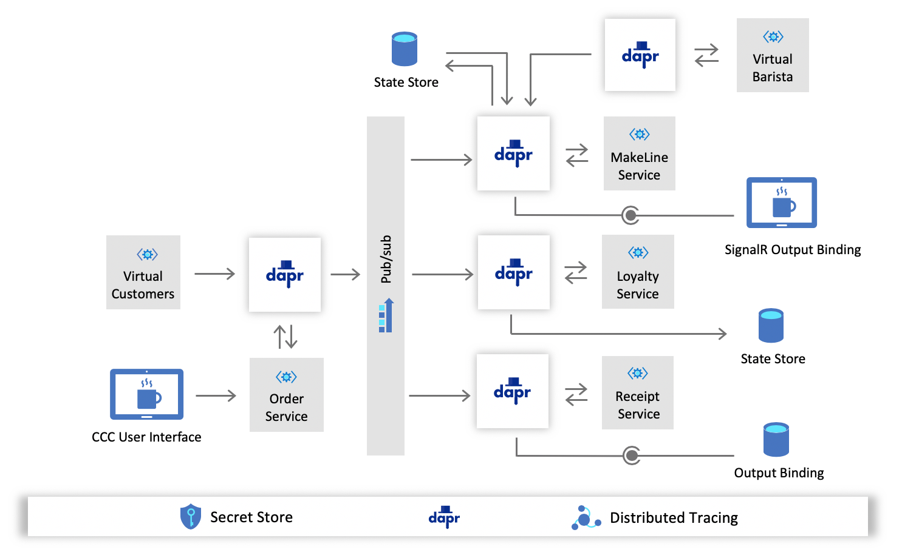

# Core Services Overview

This document is meant to be used for reference throughout the challenges. After you have read the [customer story](./../customer-story.md) and completed the [prerequisites](./../prerequisites.md), you may begin [Challenge 1](challenge-1.md).

 

| Service          | Description                                                                                                 |
|------------------|-------------------------------------------------------------------------------------------------------------|
| UI               | Web front end customers use to place their drink orders into                                                |
| Order            | Basic CRUD API that is used to place and manage orders                                                      |
| MakeLine         | Responsible for coordination of the barista make-line. Monitors the processing and completion of each order |
| Loyalty          | Manages the loyalty program for customers rewards and points based on spend                                 |
| Receipt         | Archives order receipts for auditing and historical purposes                                                |
| VirtualCustomers | A 'customer simulation' program that simulates customers placing a specified number of orders               |
| VirtualBarista   | A 'barista simulation' program that simulates the completion of drink orders.                               |

 

### Desired Final Architecture

